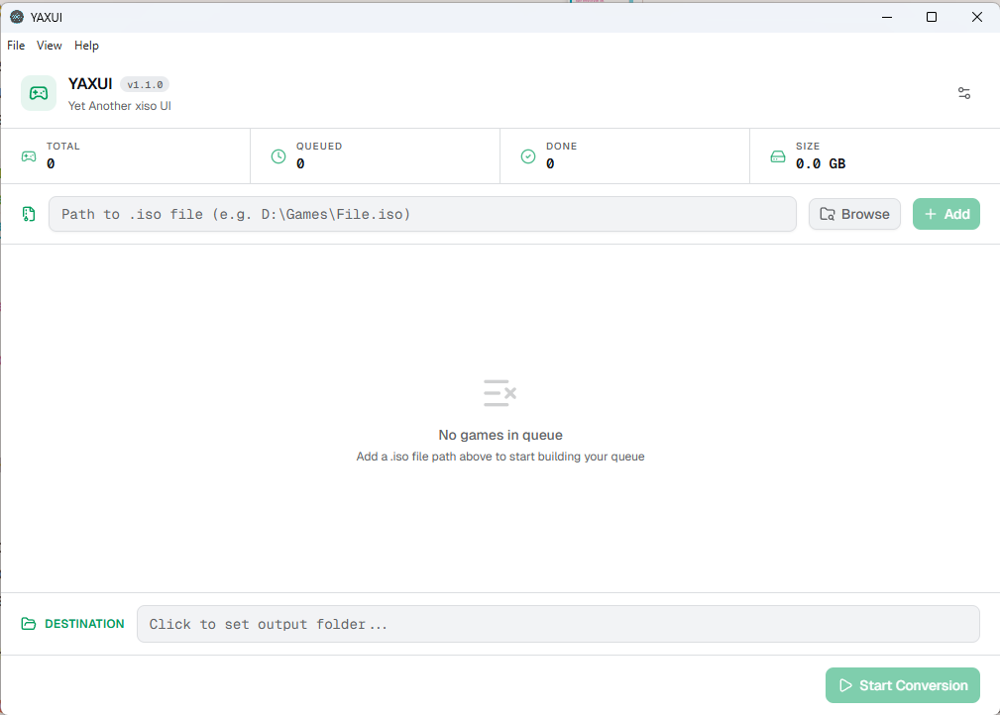

# YAXUI - Yet Another xiso UI

A desktop GUI for converting Xbox ISO files - because using `extract-xiso` via CLI on a boring Sunday afternoon was getting old.

Runs on **Windows** (x86 & x64), **macOS** (x64 & Apple Silicon) and **Linux** (AppImage).



## Download

**[→ Download the latest release](https://github.com/tuliocll/YAXUI/releases/latest)**

---


> ⚠️ This is not a polished, production-ready project. It was built in a single Sunday afternoon as a personal tool to scratch my own itch. Don't expect enterprise-grade code.

## What it does

Drop your Xbox `.iso` files into the queue, set a destination folder, and let it rip. The app handles the conversion job orchestration so you don't have to babysit a terminal.

Key features:

- **Conversion queue** - add multiple ISOs and process them in order
- **Sequential or parallel conversion** - run jobs one-by-one or in configurable batches
- **Per-game settings** - enable/disable individual items and set custom output folders per game
- **Real-time progress** - live feedback per job via IPC between the Electron main process and the renderer
- **Stop anytime** - cancel the queue mid-run without killing the app

The queue + UI is really the whole point here. The actual ISO extraction heavy lifting is done entirely by `extract-xiso` - I just built the interface and the job orchestration around it.

---

## Credits

All the hard work of actually extracting Xbox ISOs goes to **[extract-xiso](https://github.com/XboxDev/extract-xiso)** by the XboxDev team. This project is just a GUI wrapper and a job queue on top of their binary.

---

## Tech Stack

- **[Electron](https://www.electronjs.org/)** - desktop shell, handles native file dialogs and spawns the `extract-xiso` process
- **[React 19](https://react.dev/) + [TypeScript](https://www.typescriptlang.org/)** - UI layer
- **[Tailwind CSS v4](https://tailwindcss.com/)** - styling
- **[shadcn/ui](https://ui.shadcn.com/) + [Radix UI](https://www.radix-ui.com/)** - component primitives
- **[v0](https://v0.dev/)** - used to generate the initial UI design/components
- **[Webpack](https://webpack.js.org/)** - bundler, via [electron-react-boilerplate](https://github.com/electron-react-boilerplate/electron-react-boilerplate)

---

## Running locally

Clone the repo and install dependencies:

```bash
git clone https://github.com/tuliocll/YAXUI

cd YAXUI

npm install
```

Start in development mode:

```bash
npm start
```

Package for production:

```bash
npm run package
```

---

## Roadmap / Known Debt

- [ ] **Make parallel jobs optional** - add a toggle and job count control to the settings modal instead of always running multi-job
- [ ] **Per-job custom output paths** - allow setting an individual destination folder for each item in the queue, independent of the global output folder
- [ ] **Better error handling** - right now if `extract-xiso` fails for a job, it just marks it as "error" and moves on. It would be nice to capture the error message and display it in the UI.
- [ ] **Linux and macOS support** - currently only tested on Windows, but `extract-xiso` is cross-platform so in theory it should work on other OSes with some tweaks to the file dialogs and process spawning.

---

## About the author

Built by **Tulio Calil**

- Website: [tuliocalil.com](https://tuliocalil.com/)

---

## License

MIT
